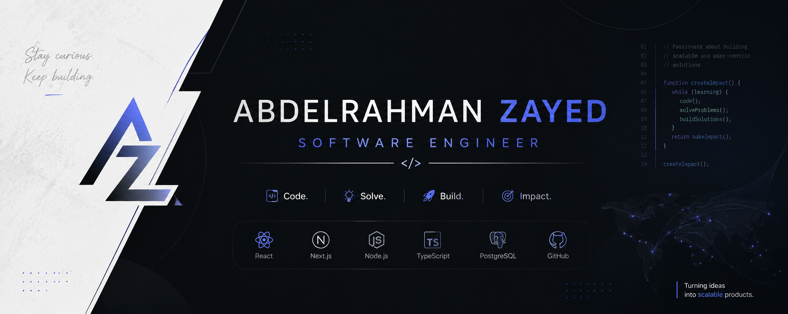

<h2 data-importer="text" align="left">👋 Hey, I'm Abdelrahman Zayed!</h2>

###

  

###

  

  

###

  
  

###

###

  
  
  
  
  
  
  
  
  
  
  
  
  
  
  
  
  
  
  
  
  
  
  
  
  
  
  
  
  
  
  
  
  
  
  
  
  
  
  
  
  
  
  
  
  

###

 

###
